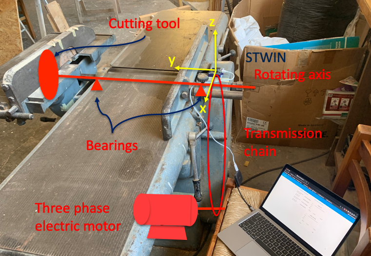
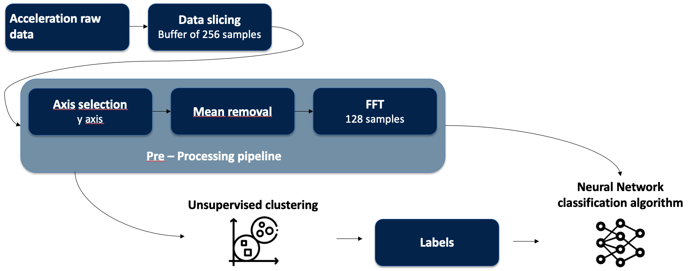
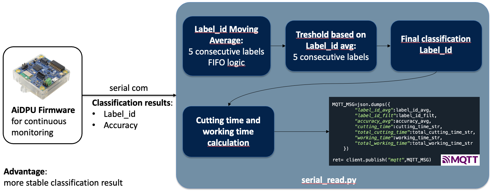
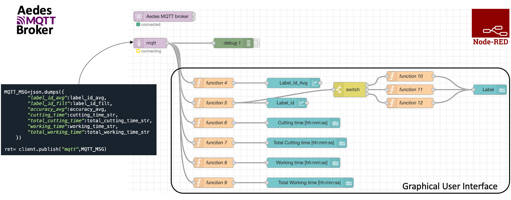
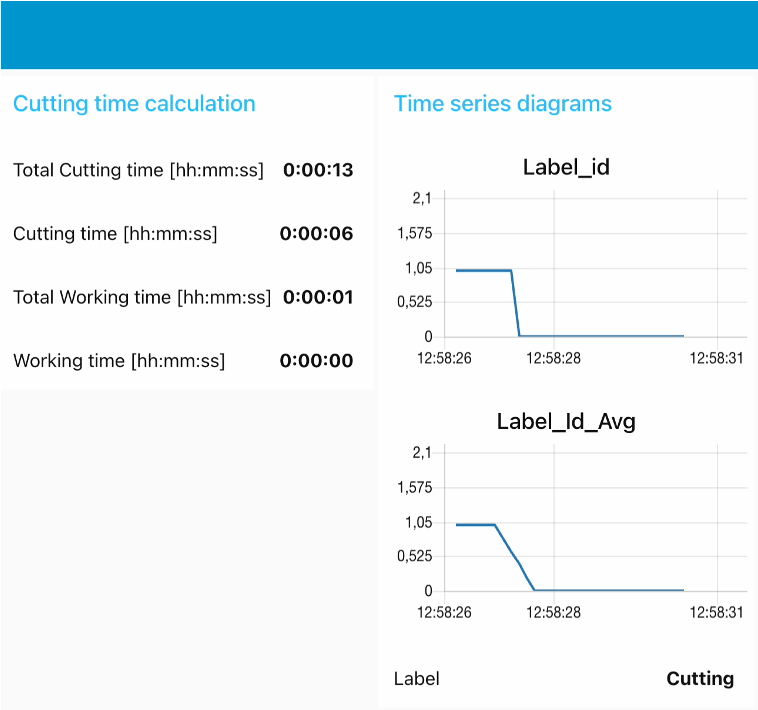

# IIoT Cutting Saw
The general idea of this project is to use a mmachine learning algorithm installed on the STWIN board microprocessor by STMicroelectronics in order to understand when the machine is off, on or when the machine is cutting a wood table. The classification algorithm is based on the accelerometric data coming from the on board three axial accelerometer (ISM330DHCX).

### Calculation of the cutting tool working time – why is it so important?

Possible prediction of the tool wear

Predictive maintenance (tool changing time)
Analytics on machine usage

Cutting process optimization 

Energy consuption optimization

 

### Acquisition parameters

 
 
 

## Signal pre-processing

 
 
 

## Signal post-processing

 
 
 

## node-red interface

 
 
 

## Graphical user interface

